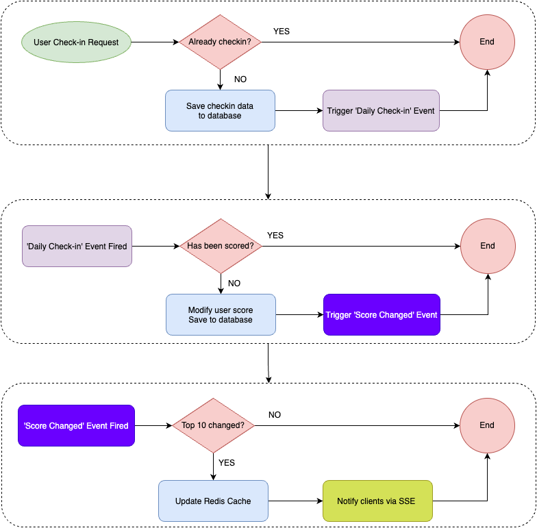

## 99Tech Code Challenge

- [Problem 6: Architecture](https://s5tech.notion.site/Problem-6-Architecture-3c32e217fa1d4a6b9b6742faec43097f)

## Assumptions

- The project's code structure follows the "Problem5" format.
- Module User Management has been implemented.
- Developer has experience in Event-Driven Programming.
- Functional requirement for the score update action:
  - **Daily Check-in**: Users can check in once per day, increasing their current score by 1.

---

# Software Module Specification: API Service for Scoreboard

## 1. Title and Overview

### 1.1 Module Name: Scoreboard API Service

**Version:** 1.0

### 1.2 Overview

This API service manages daily check-ins, score updates, and real-time scoreboard data. When users perform a "Daily Check-in," their scores increase, and these updates are immediately reflected on the website's scoreboard. The service also enforces security measures to prevent unauthorized access and multiple check-ins per day.

### 1.3 Scope

- Provides an API endpoint that allows users to perform the check-in action.
- Ensures real-time scoreboard updates.
- Prevents unauthorized check-ins.
- Ensures that users can check in only once per day, increasing their score by 1.
- Manages top 10 user scores efficiently.

---

## 2. Objectives and Requirements

### 2.1 Functional Requirements

- Allows users to check in.
- Ensures users can check in only once per day, increasing their current score by 1.
- Maintains a real-time scoreboard displaying the top 10 scores.
- Ensures secure and authorized access, preventing malicious users from manipulating scores.

### 2.2 Non-Functional Requirements

- High availability with low-latency responses.
- Secure API endpoints with authentication and validation.
- Scalable to handle increasing user activity.
- Efficient data management to maintain leaderboard performance.

---

## 3. Architecture and Design

### 3.1 High-Level Design

- The API service receives a "Check-in" request from users.
- It validates the request, updates the user’s check-in data in the database, and triggers an event to notify that a "Check-in" has occurred.
- The service handles the "Check-in" event, verifies and updates the score if necessary.
- The leaderboard is updated if necessary.
- The frontend receives updated scores via SSE (Server-Sent Events).

### 3.2 Data Flow and Interfaces

1. **User performs check-in** → API receives a request.
2. **API validates the request** → Ensures authentication and that users can check in only once per day.
3. **Database update** → The daily check-in record is updated, the score is modified, and the leaderboard is checked.
4. **Trigger "Daily Check-in" Event** → The "Daily Check-in" event is handled, the score is modified, and the updated score is saved to the database.
5. **Trigger "Score Changed" Event** → The "Score Changed" event is handled, and the leaderboard is updated if there are changes in the top 10 rankings.
6. **Live update trigger** → If the leaderboard changes, notify clients.



### 3.3 Technology Stack

- **Backend:** Node.js - NestJS
- **Database:** PostgreSQL / Redis (for caching)
- **Real-time Updates:** Server-Sent Events (SSE)
- **Authentication:** JWT-based authentication

---

## 4. APIs and Interfaces

### 4.1 Public Interfaces

#### 1. Daily Check-in API

**Endpoint:** `/api/users/checkin`  
**Method:** `POST`  
**Request:**

```json
{}
```

**Response:**

```json
{
  "statusCode": "200",
  "data": true
}
```

#### 2. Leaderboard API

**Endpoint:** `/api/live/leaderboard`  
**Method:** `SSE`  
**Response:**

```json
{
  "type": "LEADER_BOARD",
  "data": [
    { "userId": "1", "fullName": "A", "score": 200 },
    { "userId": "2", "fullName": "B", "score": 180 },
    { "userId": "3", "fullName": "C", "score": 160 },
    { "userId": "4", "fullName": "D", "score": 150 },
    { "userId": "5", "fullName": "E", "score": 140 },
    { "userId": "6", "fullName": "F", "score": 130 },
    { "userId": "7", "fullName": "G", "score": 120 },
    { "userId": "8", "fullName": "H", "score": 110 },
    { "userId": "9", "fullName": "I", "score": 100 },
    { "userId": "10", "fullName": "K", "score": 90 }
  ]
}
```

### 4.2 Error Handling

- **Invalid action token** → `403 Forbidden`
- **Database failure** → `500 Internal Server Error`
- **Malformed request** → `400 Bad Request`

### 4.3 Data Contracts

- **UserScore:** `{ "userId": string, "fullName": string, "score": integer }`
- **MessageEvent:** `{ "type": string, "data": [UserScore] }`

---

## 5. Workflow and Use Cases

### 5.1 Typical Scenarios

1. A user performs a check-in action → API updates check-in data.
2. The user’s score is updated → If in the top 10, update the leaderboard.
3. The scoreboard is updated via SSE.

### 5.2 Edge Cases

- Multiple users finishing actions simultaneously.
- Users attempting unauthorized check-ins.
- Large influx of new scores affecting leaderboard performance.

### 5.3 State Management

- Scores persist in a database.
- Leaderboard cached for performance.
- Server-Sent Events for real-time updates.

---

## 6. Implementation Steps

### 6.1 Database Schema

- Create a `ScoreSource` enum to identify the source of score updates.
- Create a `user_checkin` table to store user check-in records (`userId`, `date`).
- Create a `user_score` table to store user scores (`userId`, `score`).
- Create a `score_history` table to log each score update (`userId`, `scoreSource`, `timestamp`).

### 6.2 API Endpoints

- Implement the `POST /api/users/checkin` endpoint to log user check-in data and fire the "Daily Check-in" event.
- Implement the `SSE /api/live/leaderboard` endpoint to broadcast top 10 scores whenever the leaderboard changes.

### 6.3 Event Handlers

- Implement the "Daily Check-in" event handler to validate check-ins, update user scores, and trigger the "Score Changed" event.
- Implement the "Score Changed" event handler to validate top 10 scores and emit leaderboard updates.

---

## 7. Security and Compliance

- **Authentication:** JWT-based user validation.
- **Authorization:** Signed action tokens prevent unauthorized updates.
- **Rate Limiting:** Prevent spam or bot-driven score updates.
- **Data Integrity:** Store score updates securely with audit logging.

---

## 8. Performance and Scalability

- **Efficient query:** Use indexed database
- **Efficient SSE:** Use `throttle` to enhance performance, reduce compute and bandwidth usage
- **Caching:** Store top 10 scores in Redis for quick access.
- **Scalable architecture:** Load balancing and horizontal scaling.

---

## 9. Testing and Validation

### 9.1 Unit Tests

- Validate API endpoints.
- Check authentication and authorization mechanisms.

### 9.2 Integration Tests

- Ensure the API correctly updates the daily check-in record.
- Ensure the user's score is updated correctly.
- Verify leaderboard updates accurately reflect changes.

### 9.3 Performance & Stress Testing

- Simulate high traffic to test scalability.
- Measure response times.

---

## 10. Deployment and Maintenance

- **Deployment Process:** CI/CD pipeline for automated deployments.
- **Logging & Monitoring:** Track API usage and errors.
- **Versioning:** API versioning to support future updates.

---

## 11. Glossary and References

- **JWT:** JSON Web Token used for authentication.
- **Server-Sent Events:** Server push technology
  - [Document](https://developer.mozilla.org/en-US/docs/Web/API/Server-sent_events)
  - [NestJs SSE](https://docs.nestjs.com/techniques/server-sent-events)
- **Redis:** In-memory data structure store used for caching.

## 12. Improvements

- For large-scale application
  - Using Message Broker (Kafka for example) to distribute events
  - Isolate the Live Module as an independent service to enhance performance.
